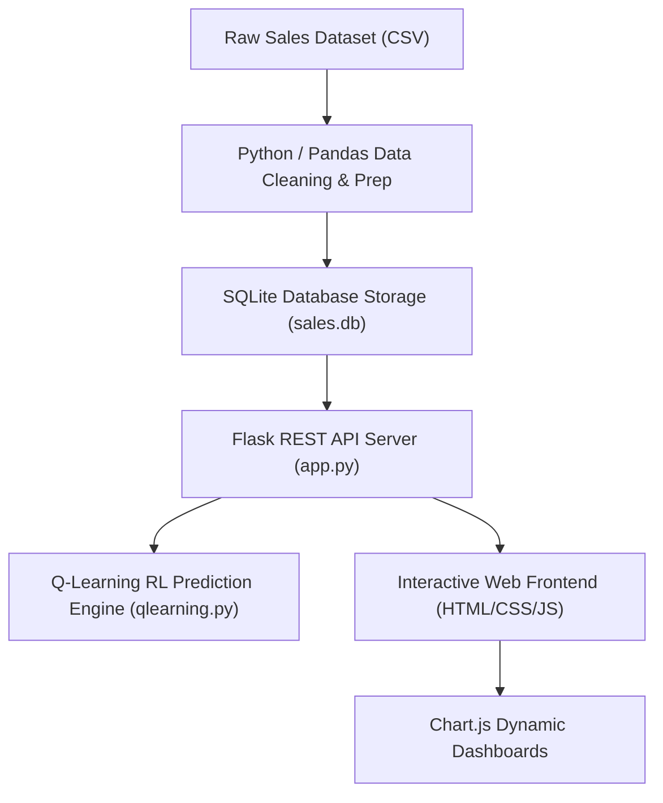

# 📊 Sales Trend Analysis

> An end-to-end data analytics platform and Q-Learning prediction system built to extract actionable profitability insights, regional trends, and demand forecasts from Superstore transactional sales records.

---

## 📌 Overview

**Sales Trend Analysis** is a Python-based data analytics and machine learning application designed to transform raw retail sales datasets into clear, actionable business intelligence. 

In retail and e-commerce environments, decision-makers often struggle to interpret raw transaction logs spread across multiple regions, product categories, and customer segments. This platform addresses that challenge by:
1. Cleaning raw transactional logs and storing them in an optimized **SQLite** database.
2. Aggregating multi-dimensional metrics (Sales Revenue, Profit Margins, Order Counts, Category Share, Regional Trends).
3. Utilizing a **Q-Learning Reinforcement Learning** model to forecast sales demand transitions.
4. Exposing analytics endpoints via a **Flask REST API** to an interactive **HTML/CSS/JS** frontend powered by **Chart.js**.

---

## 🎯 Objectives

- **Automate Data Ingestion**: Read raw CSV transaction datasets and clean null values, formatting errors, and inconsistent column headers.
- **Relational Data Storage**: Store cleansed records in a local **SQLite** database for fast analytical querying.
- **Multi-Dimensional Analysis**: Compute total revenue, profit margins, order velocity, regional distributions, and product category breakdowns.
- **Reinforcement Learning Prediction**: Apply a Q-Learning algorithm to model state-action-reward demand transitions based on historical sales sequences.
- **Visual Dashboarding**: Render dynamic line graphs, scatter plots, bar charts, and pie charts for executive stakeholder reporting.

---

## 📂 Dataset

The application utilizes the **Superstore Sales Dataset** (`superstore_sales.csv` / `Sales_Data.csv`). 

### Core Schema Fields:
| Field Name | Type | Description |
| :--- | :--- | :--- |
| `Order_ID` | String | Unique transaction order identifier |
| `Order_Date` | Date String | Date order was placed |
| `Region` | String | Geographic region (North, South, East, West) |
| `Category` | String | Product segment (Technology, Furniture, Office Supplies) |
| `Sub_Category` | String | Detailed product classification (Phones, Chairs, Storage, etc.) |
| `Sales` | Float | Gross transaction revenue value ($) |
| `Quantity` | Integer | Units sold per order |
| `Discount` | Float | Discount percentage applied |
| `Profit` | Float | Net profit generated ($) |

---

## 🧹 Data Processing

The backend processing script (`backend/app.py` & `backend/analysis.py`) executes the following ETL workflow:
1. **Encoding Handling**: Ingests raw CSV files using `latin1` encoding with Python fallback engines.
2. **Header Standardization**: Replaces spaces in column titles with underscores (`df.columns.str.replace(" ", "_")`).
3. **Database Injection**: Injects clean DataFrames into the `sales` table inside `sales.db` using SQLite connection interfaces.
4. **Date Parsing**: Converts string timestamps to pandas `datetime` objects (`pd.to_datetime()`) and extracts numerical month indices for temporal grouping.
5. **Regional Filtering**: Filters underlying DataFrame slices dynamically based on regional user selection.

---

## 🔍 Analytics Performed

The analytical engine computes the following core business metrics:
- **Sales Revenue & Growth**: Total aggregate sales across all completed transactions.
- **Profitability Analysis**: Net profit calculation and Sales vs. Profit scatter relationship mapping.
- **Regional Analysis**: Aggregated revenue distribution across geographic sales territories.
- **Category & Product Analysis**: Breakdown of revenue contributions across Technology, Furniture, and Office Supplies.
- **Order Volume**: Total order counts and average transaction values.

---

## 🤖 Q-Learning / Reinforcement Learning Component

Located in `backend/qlearning.py`, the project incorporates a **Q-Learning Reinforcement Learning** algorithm to predict sales demand trends.

### High-Level RL Formulation:
- **States ($S$)**: Represents discrete monthly sales sequence positions derived from historical dataset aggregation.
- **Actions ($A$)**: Represents transition state decisions ($A = 2$) estimating upward or downward demand velocity.
- **Reward Function ($R$)**: Mapped directly to the historical sales revenue value observed at each state step.
- **Update Rule**: Iteratively updates the Q-table matrix over 500 training episodes using the standard Bellman Q-learning equation:

$$Q(s, a) \leftarrow Q(s, a) + \alpha \left[ R + \gamma \max_{a'} Q(s', a') - Q(s, a) \right]$$

- **Parameters**: Learning rate $\alpha = 0.1$, discount factor $\gamma = 0.9$, exploration rate $\epsilon = 0.1$.
- **Output**: Returns the expected mean Q-value prediction score (`round(prediction, 2)`) to serve as the demand forecast indicator.

---

## 📊 Visualizations

The application generates dynamic web charts via **Chart.js** (`frontend/script.js`) alongside static plot exports saved in `graphs/`:

| Chart Type | Primary Metric Rendered | Export File |
| :--- | :--- | :--- |
| **Line Chart** | Monthly Sales Revenue Trend | `graphs/sales_trend.png` |
| **Scatter Plot** | Sales vs. Profit Correlation | `graphs/sales_profit.png` |
| **Bar Chart** | Region-wise Sales Distribution | `graphs/region_sales.png` |
| **Pie Chart** | Category Sales Share Percentage | `graphs/category_sales.png` |
| **Bar Chart** | Top Performing Products Breakdown | `graphs/top_products.png` |
| **Line Plot** | Sales Forecast Trajectory | `graphs/forecast_sales.png` |

---

## 🏗️ System Architecture Workflow



---

## 🛠️ Technology Stack

- **Programming Languages**: Python, JavaScript (ES6+)
- **Data Analytics & Math**: Pandas, NumPy, Matplotlib
- **Database**: SQLite (`sales.db`)
- **Backend Framework**: Flask, Flask-CORS
- **Frontend & Visualization**: HTML5, CSS3, JavaScript, Chart.js
- **Machine Learning / AI**: Q-Learning (Reinforcement Learning)

---

## 📁 Project Structure

```
sales-trend-analysis/
├── backend/
│   ├── analysis.py          # Standalone analytics helper functions
│   ├── app.py               # Flask REST API endpoints & SQLite database handler
│   └── qlearning.py         # Q-Learning reinforcement prediction model
├── frontend/
│   ├── index.html           # Interactive web dashboard layout
│   ├── script.js            # Fetch API integrations & Chart.js rendering
│   └── style.css            # Custom CSS styling & responsive layout
├── graphs/
│   ├── category_sales.png   # Exported category share chart
│   ├── forecast_sales.png   # Exported demand forecast chart
│   ├── region_sales.png     # Exported regional distribution chart
│   ├── sales_profit.png     # Exported sales vs profit scatter plot
│   ├── sales_trend.png      # Exported monthly sales trend plot
│   └── top_products.png     # Exported top products bar chart
├── Sales_Data.csv           # Alternative sales dataset
├── superstore_sales.csv     # Primary Superstore dataset
├── .gitignore               # Git ignored files & dependencies
└── README.md                # Project documentation
```

---

## 🚀 How to Run Locally

### 1. Prerequisite
Ensure **Python 3.8+** is installed on your local machine.

### 2. Clone the Repository
```bash
git clone https://github.com/Azhar0612/sales-trend-analysis.git
cd sales-trend-analysis
```

### 3. Install Backend Dependencies
```bash
pip install flask pandas numpy flask-cors
```

### 4. Start the Flask Backend Server
```bash
cd backend
python app.py
```
*The local Flask server will start running at:* `http://127.0.0.1:5000` *(Local development URL).*

### 5. Launch the Frontend
Open `frontend/index.html` directly in your web browser (or serve it via any local static server). Load `superstore_sales.csv` using the file picker to trigger real-time dataset analysis.

---

## 📈 Application Output

Upon running the analysis pipeline, the system outputs:
- **Interactive KPI Cards**: Displaying Total Sales ($), Total Profit ($), Total Order Count, and Q-Learning Prediction Value ($).
- **Dynamic Charts**: Multi-dimensional visual representation of monthly sales, scatter profit distributions, regional share, and category proportions.
- **Exported Plots**: Pre-rendered Matplotlib PNG charts stored in `graphs/` for reporting.

---

## 🧪 Research Paper

**Sales Trend Analysis** represents an undergraduate research project conducted by **Mohammad Azhar** alongside student co-researchers (N. Abhinav, P. Sumanth) under the guidance of Mr. Rampaka Manoj Kumar, Dr. V. Indrani, and Dr. G. Janardhana Raju (Dept. of CSE - Data Science, Nalla Narasimha Reddy Group of Institutions).

- **Research Paper PDF**: Available in the portfolio repository at [`Sales_Trend_Analysis_Research_Paper.pdf`](https://github.com/Azhar0612/azhar-portfolio/blob/main/public/assets/research/Sales_Trend_Analysis_Research_Paper.pdf).

---

## 📚 Base / Reference Paper

- **Reference Literature**: *"AI-Powered Alternative Credit Assessment Platform for Financial Inclusion"* (by Sumit Agarwal, Shashwat Alok, Pulak Ghosh, Sudip Gupta) serves as a separate foundational literature reference paper within the broader academic portfolio.

---

## 🔗 Related Links

- **Personal Portfolio**: [https://github.com/Azhar0612](https://github.com/Azhar0612)
- **GitHub Repository**: [https://github.com/Azhar0612/sales-trend-analysis](https://github.com/Azhar0612/sales-trend-analysis)
- **LinkedIn Profile**: [https://www.linkedin.com/in/azhar-mohammad69](https://www.linkedin.com/in/azhar-mohammad69)

---

## 🔮 Future Improvements

- Integrate deep learning sequential forecasting models (LSTM / GRU) alongside Q-Learning.
- Implement automated PDF and Excel analytical report generation.
- Add user authentication and multi-tenant database access control.
- Support live streaming real-time transactional data ingestion endpoints.

---

## 👨‍💻 Author

**Mohammad Azhar**  
*B.Tech — Computer Science Engineering (Data Science)*  
- **LinkedIn**: [linkedin.com/in/azhar-mohammad69](https://www.linkedin.com/in/azhar-mohammad69)  
- **GitHub**: [github.com/Azhar0612](https://github.com/Azhar0612)  
- **Email**: azharmd98803@gmail.com
